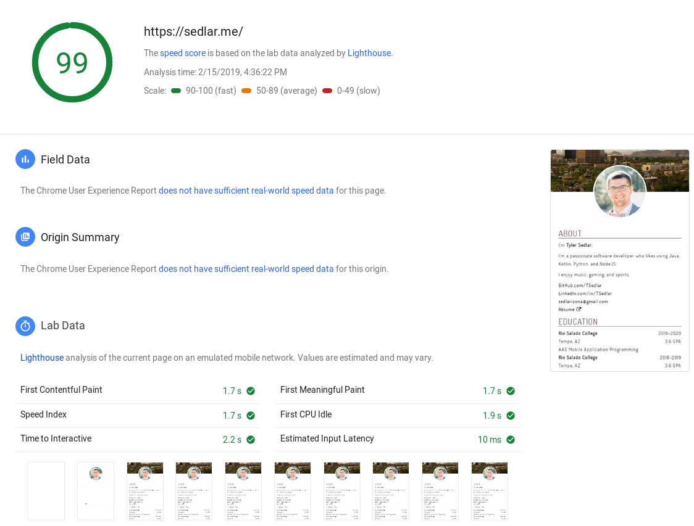

# ElTag

[](LICENSE)
[](https://www.patreon.com/bePatron?c=954360)
[](https://paypal.me/TSedlar)

[](https://www.jsdelivr.com/package/gh/TSedlar/eltag)

A blazing fast HTML Tag Component Micro-framework

Supports all of the below in under 5kb!:
- Component states
- Parent component states
- All style variables
- All event listeners

### Retrieving:

JSDelivr kindly hosts this script [here](https://www.jsdelivr.com/package/gh/TSedlar/eltag)

```html
<script type='text/javascript' src='https://cdn.jsdelivr.net/gh/TSedlar/eltag@1.0.0/eltag.min.js'>
```

### Example usage:

[codepen](https://codepen.io/tsedlar/pen/MLzyPE?editors=1000)

```html
<script>
  const { renderElement, app, range, p, span, button } = ElTag;

  const main = app({
    state: { ctr: 1 }
  }, [
    p(range(0, 5, (idx, ctx) => span({ 
      class: 'counter',
      state: { offset: idx },
      render: () => this.parent.state.ctr + this.state.offset
    }))),
    button({
      onclick: () => this.setState({ ctr: Math.max(0, this.state.ctr - 1) })
    }, '-'),
    button({
      onclick: () => this.setState({ ctr: this.state.ctr + 1})
    }, '+')
  ]);

  renderElement(document.body, main);
</script>
```

### Personal PageSpeed Result:
[Test page source](https://github.com/TSedlar/tsedlar.github.io/blob/master/index.html)


